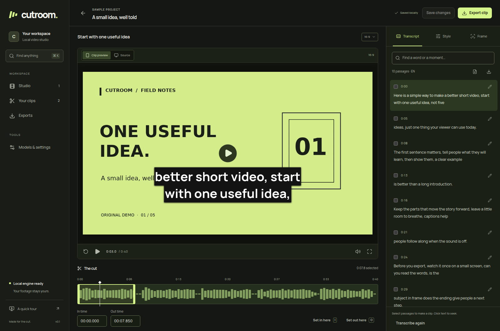

# Cutroom

**Turn long recordings into captioned clips on your own computer.**

[](https://github.com/Batuktech/Cutroom/actions/workflows/ci.yml)
[](LICENSE)

Cutroom is a local-first video clipping studio with transcript editing, optional AI highlight discovery, animated captions, YouTube imports, and MP4/SRT exports. No account, paid inference API, or subscription is required by the app.



*The screenshot uses Cutroom's original synthetic demo. No user footage is included in this repository.*

## What you can do

- **Find moments in long videos.** Select transcript passages, set in/out points, or ask local Qwen or an optional cloud API model to propose candidates across multiple interests.
- **Review findings while AI works.** Choose Discovery, Reviewed, or Strict; see candidates as sections finish; stop early and keep findings. Request up to 30 candidates with a maximum length of 20–100 seconds. Shorter clips still qualify.
- **Transcribe locally.** Optional Whisper Tiny, Base, Small, and Large v3 produce editable text and word timings on CPU. Import existing SRT or WebVTT instead when you have subtitles.
- **Style captions.** Highlight, Word Pop, Punchy Phrases, Build-up, Studio, Bold, and Minimal; one-word or short-phrase pacing; editable size, position, and color.
- **Frame and export.** 16:9, 9:16, 1:1, and 4:5; crop or fit; 720p/1080p H.264/AAC MP4, separate SRT, and delivery ZIPs. New clips default to **Highlight + 16:9**.
- **Import finished YouTube replays.** Download a bounded range or split it into 15/30/60-minute projects. Each project stays independently editable.
- **Keep control of files.** Local project storage, metadata backup/restore, cancellable jobs, transcript history, and confirmed project-file deletion.

## Quick start

The tested platform is **Ubuntu/Linux**. Install **Node 22.12+**, npm, and **FFmpeg/FFprobe with libass and libx264**. A GPU is not required for manual editing or Whisper.

```sh
git clone https://github.com/Batuktech/Cutroom.git
cd Cutroom
npm ci
npm run build
npm run doctor
npm start
```

Open **http://127.0.0.1:4318**, then open the sample or import a recording. Stop with Ctrl+C. No AI model download is needed to try manual editing, subtitle import, and rendering.

For development, run `npm run dev`: UI on port **5173**, API on **4318**. Do not run development and normal startup together against the same port. See [installation](docs/installation.md) and [.env.example](.env.example) for prerequisites and optional configuration.

### Add speech recognition and YouTube imports

With Python 3.10+ and venv support installed:

```sh
npm run setup:ai
```

Restart Cutroom. For transcription, install a model in **Studio settings → Speech models**. The Python setup downloads dependencies; model installation downloads weights separately. No model is preinstalled in this repository. [Model choices and tradeoffs](docs/large-model.md).

### Add local AI clip discovery

Qwen3-8B uses a separate runtime and approximately 5 GB of weights. The current integration targets **Linux + NVIDIA + Vulkan**, with approximately 3 GB available system RAM and 3.8 GB free GPU memory required before inference. It is optional and is not installed by `setup:ai`.

Follow [Qwen setup](docs/qwen-setup.md), then **Suggest cuts → AI review → Local Qwen3-8B**. Select several interests, a maximum length, and a review mode. Preview findings and explicitly add the ones you want. Fast transcript rules remain available without Qwen. [How selection works](docs/ai-suggestions.md).

### Use your own cloud AI key instead

Choose from 16 providers—including OpenAI, Anthropic, GLM/Z.ai, Kimi/Moonshot, Gemini, DeepSeek, and OpenRouter—or a custom OpenAI-compatible service in **Studio settings → Cloud AI**. Then select the provider and model in **Suggest cuts → AI review**, set a request cap, and confirm sharing transcript text. No local Qwen model or GPU is required. API usage may cost money; ChatGPT/Claude subscriptions are separate from API billing. UI-entered keys remain in server memory until restart. [Setup, privacy, billing, and limits](docs/byok.md).

## A typical edit

1. Import a local video or a public finished YouTube replay.
2. Transcribe it or import SRT/VTT. Correct important words and timing.
3. Select a passage or review suggested moments; create clips.
4. Choose the frame and caption style, then save.
5. Export, watch the actual rendered result, and download the MP4/SRT or delivery ZIP.

Keyboard shortcuts: **Space** play/pause, **←/→** seek, **I/O** set clip boundaries, **Ctrl/Cmd+S** save, and **Ctrl/Cmd+K** search. Text fields keep their normal typing behavior. The editor prompts before leaving unsaved changes.

## Privacy and storage

The API binds to `127.0.0.1`. Cutroom has no authentication system and is intended for one user on their own computer, not public hosting. Media processing and installed-model inference are local; dependency/model downloads and YouTube imports use the internet explicitly. Optional cloud AI review sends transcript text, timestamps, and editorial guidance to your chosen provider after confirmation. Audio and video remain local. The app does not extract browser cookies.

Data defaults to `.cutroom/`: copied source media, transcripts, clip settings, exports, job history, and models. Back up the entire directory while the app is stopped. Metadata exports do not include footage. **Delete project and files** permanently deletes registered local assets after confirmation. [Storage, privacy, and recovery](docs/privacy.md).

## Limits

- This is pre-1.0 software and a source distribution, not a packaged desktop installer. Windows and macOS are not verified end to end.
- Each imported project is limited to **2 GB and three hours**. Use bounded parts for longer finished replays. Active livestreams and playlist-only imports are unsupported.
- Whisper can mishear speech. Qwen reads text, not expressions, music, video frames, or audience analytics. Suggestions can miss good moments or return fewer clips than requested; they do not predict views or income.
- Local transcription and AI review can take many minutes on long recordings. One processing queue limits contention but does not guarantee smooth multitasking.
- Face assistance suggests a fixed crop from sampled frames; it does not track a moving speaker. There is no speaker diarization, multi-track montage, generative video, or automatic social publishing.
- YouTube availability and formats can change. Import only recordings you are entitled to use.

## Development

React 19 + TypeScript + Vite, Express, atomic JSON storage, Python workers, and FFmpeg. Existing Radix controls and bundled fonts keep the interface local. Models and media remain outside Git.

```sh
npm run lint
npm run typecheck
npm test
npm run test:python
npm run check:docs
npm run build
```

CI checks Node 22/24 and real caption rendering. Full transcription, network downloads, and GPU tests are opt-in; see [testing prerequisites](docs/testing.md). A passing mechanics test does not establish transcription or suggestion quality.

## Documentation and contributing

| Resource | Start here for |
| --- | --- |
| [Installation](docs/installation.md) · [Configuration](docs/configuration.md) | Running a fresh checkout. |
| [AI review](docs/ai-suggestions.md) · [Qwen setup](docs/qwen-setup.md) · [Cloud BYOK](docs/byok.md) | Local or optional cloud clip discovery. |
| [Long replays and captions](docs/long-streams-and-captions.md) | Range downloads and word/phrase styles. |
| [Architecture](docs/architecture.md) · [Testing](docs/testing.md) | Understanding and changing the implementation. |
| [Troubleshooting](docs/troubleshooting.md) | Startup, media, model, and recovery problems. |
| [Contributing](CONTRIBUTING.md) · [Code of Conduct](CODE_OF_CONDUCT.md) | Issues and pull requests. |
| [AGENTS.md](AGENTS.md) · [llms.txt](llms.txt) | Repository instructions and discovery for coding agents. |
| [Security policy](SECURITY.md) · [Changelog](CHANGELOG.md) | Private reports and current scope. |

Bug reports with synthetic reproductions, accessibility fixes, tests, and hardware compatibility work are welcome. Read the contributor guide before a substantial change.

## License

Cutroom's original application source is [MIT licensed](LICENSE). Fonts, installed dependencies, and separately downloaded models retain their own licenses; see [third-party notices](THIRD_PARTY_NOTICES.md). No user recordings or AI model weights are distributed here.
