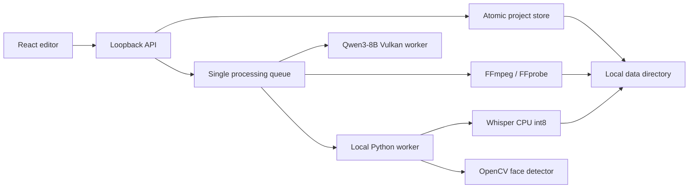

# Local architecture

The browser talks to an Express server bound to `127.0.0.1`. During development Vite proxies `/api` to that server. For normal single-process use, Express serves the built interface from `dist/`.

## Responsibilities

| Location | Responsibility |
| --- | --- |
| `src/App.tsx` | Navigation, library data, global search, queue polling, notifications |
| `src/components/Editor.tsx` | Selected clip, explicit save, navigation guard, processing actions |
| `src/components/Preview.tsx` | Browser playback, crop preview, shared caption timing |
| `src/components/Inspector.tsx` | Transcript editing, clip creation from ranges, styles and framing |
| `src/components/Timeline.tsx` | Waveform, seeking, numeric and slider trims |
| `server/index.ts` | Validated local HTTP routes, upload/download, delivery ZIP |
| `server/store.ts` | Serialized transactional updates and atomic JSON replacement |
| `server/jobs.ts` | Queue, deduplication, cancellation, subprocess limits, job history |
| `server/media.ts` | FFprobe, media import, transcription, crop and export coordination |
| `server/backup.ts` | Schema-validated additive recovery and missing-file checks |
| `server/domain.ts` | Clip/segment validation, fast suggestions, SRT and ASS output |
| `server/suggestions.ts`, `server/suggestion-domain.ts` | Local Qwen readiness, queue runner, grounded proposal validation, review acceptance |
| `scripts/suggest_worker.py`, `scripts/suggest_logic.py` | Overlapping transcript sections, discovery/optional second review, resource monitoring |
| `src/components/SuggestionDialog.tsx` | Multiple interests, duration/filter controls, live findings, preview and explicit acceptance |
| `shared/captions.ts` | Cue grouping and font-metric conversion shared by preview/render |
| `src/lib/useVideoClock.ts` | Caption timing from displayed video frames, with a frame-loop fallback |
| `scripts/ai_worker.py` | Offline speech recognition, face sampling, explicit model installation |

## Boundaries

This is a single-user local application. It has no accounts or tenant system and should remain bound to loopback. Requests require an allowed local Host; supplied Origin headers must match the local interface/API. Media and export downloads resolve registered IDs, and restore files cannot introduce arbitrary paths. Subprocesses receive argument arrays rather than shell command strings. Subtitle text cannot inject ASS control sequences; crop positions, dimensions, colors, and timing are validated.

FFmpeg and FFprobe receive a `file,pipe` protocol whitelist. A submitted file cannot make these tools fetch a remote media playlist. Uploaded files must pass probing before they reach the Python workers. This boundary is covered by a network-playlist integration fixture.

Fonts are bundled. There is no analytics, cloud media storage, or remote inference. Dependencies are downloaded during installation. Model installation contacts Hugging Face. YouTube URL import is a separate explicit internet operation: a canonical video ID is passed to the project-local yt-dlp worker. User configuration, browser cookies, external plugins, and remote EJS components are not loaded. The existing Node runtime executes the installed EJS package. The Python transcription path requires a completed local model and sets offline mode.

## Persistence and processing

A project update clones the current store, applies its change inside a serialized transaction, writes a temporary JSON file, and renames it before replacing the in-memory store. Failed writes leave the previous metadata state available. Source footage is never rewritten during editing. The library's Delete project and files action requires explicit confirmation and unlinks registered source/preview/export assets and associated caption history. It checks for other project references and validates every file before deletion, without following symlinks. Active or still-stopping workers prevent deletion. The project entry remains if file deletion fails, allowing a retry; already unlinked files cannot be recovered. The legacy metadata-only DELETE route remains available for compatibility and preserves media.

YouTube downloads run in the existing queue, write to a unique temporary folder, and enter media storage only after the downloader returns one complete file. The usual FFprobe, thumbnail, and waveform import follows. Failure/cancellation cleans that job's temporary download and any uncommitted source copy. Cancellation signals the subprocess group on Linux so child download/merge processes stop too.

Only one processing job runs at a time. FFmpeg and numerical libraries are limited to two threads where supported. Jobs have cancellation and a one-hour subprocess timeout, with shorter timeouts for probing and thumbnails. Large v3 transcription allows up to six hours because full-size recognition can be slow on CPU; cancellation remains available. Completed and failed job records persist. A server restart does not silently restart an incomplete export or download.

Compatible previews are written to a temporary file and atomically renamed after successful conversion, preserving an existing preview on cancellation. Failed exports remove their incomplete output files. Transcription completion checks whether captions changed while the worker ran; it preserves the newer edit instead of replacing it with an older job's result.

Transcription saves the previous captions as JSON/SRT and retains the worker result in `transcript-history/`, including when a concurrent caption edit prevents applying that result. Empty recognition cannot replace a transcript. The worker processes the original audio timeline without VAD concatenation, using five-beam decoding and measured word timestamps. Caption groups split at pauses and do not overlap their neighbors.

Exports capture clip settings when queued. Editing a clip after an export leaves the old file available and marks the clip as a draft for a fresh render. Delivery packs default to the latest rendered version of each clip. The Exports page can include older versions when you need the full render history. A latest render may still predate unsaved or unrendered edits; preview it before handing it over.

## Deliberate limits

JSON storage is appropriate for this local studio but is not a shared multi-user database. Uploads are limited to 2 GB, source duration to three hours, and individual clips to thirty minutes. CPU transcription/rendering of long or high-resolution footage can take substantial time. Files unsupported by browser playback may need a local compatible preview; exports use the original source. HDR color-management and professional audio mastering are not implemented.

To move the studio, stop it and copy the entire data directory. To recover removed library entries, restore exported metadata after copying the associated source files into the data directory. Existing projects are never overwritten by the restore route.

## Qwen review persistence

`POST /api/projects/:id/suggestions/analyze` queues a deduplicated `suggest` job using the installed local GGUF model. The two-hour worker runs within the shared processing queue and unloads after use. Temporary transcript/result files are removed after success, failure, or cancellation. No inference requests leave this computer.

The optional `Project.suggestions` contains a review ID, source fingerprint, timestamp, settings, section/review counts, a requested candidate count, and up to thirty candidates. `POST /api/projects/:id/suggestions/accept` validates the review ID, source fingerprint, and selected IDs transactionally before adding default 16:9 clips with Highlight captions. It is idempotent for already-saved time ranges. Concurrent transcript changes reject analysis application and acceptance with an explanatory message; a cancelled worker cannot save a review while waiting for a store transaction. Backups validate and preserve review metadata. The legacy `/suggestions` endpoint remains the fast-rule method.

The shared suggestion options separate a hard maximum duration from minimum duration and allowed pauses. Multiple interests use ANY-match semantics. Discovery is the default; Reviewed retains second-pass uncertainties and Strict rejects them. Sections overlap by approximately 25%. Quoted evidence is copied from indexed source segments, and both worker and API enforce bounds.

Worker checkpoint events feed a serialized promise chain of transactional review writes. One review ID and stable IDs per source range span the job. `complete: false` and section counts distinguish partial scans. Saved checkpoints expose `job.result.scanned`; App polling refreshes projects only when that value advances or a job terminates. This brings findings into an open dialog while preserving unsaved editor state. Cancellation and source-fingerprint checks run again inside each store transaction, preventing delayed writes from applying after cancellation or a transcript edit. Already-saved partial reviews remain usable after cancellation/restart. Empty early checkpoints preserve a previous useful review; final results replace it.

## Range downloads and timed caption modes

YouTube import accepts an optional numeric source range, optional part interval, and 720/1080 quality. Shared range planning validates the complete batch before enqueueing up to 24 independent jobs. Dedupe keys include canonical URL, range, and quality. The Python worker permits long finished replays only when a bounded section is selected, applies FFmpeg section seeking/re-encoding and a file-size cap, and checks measured output duration before import. User input never becomes a shell command. Each downloaded part has a separate project and cancellation entry.

Optional `captionMode` and `captionDuration` preserve compatibility with older clips. API defaults and shared edit comparison normalize old settings without falsely marking unchanged exports dirty. Preview, ASS output, and SRT grouping use the same word/phrase cues. The pop scale phase is based on the original cue start and retained when a clip trims into a cue. Build-up exports discrete word-reveal events. See [workflow and verification](long-streams-and-captions.md).
